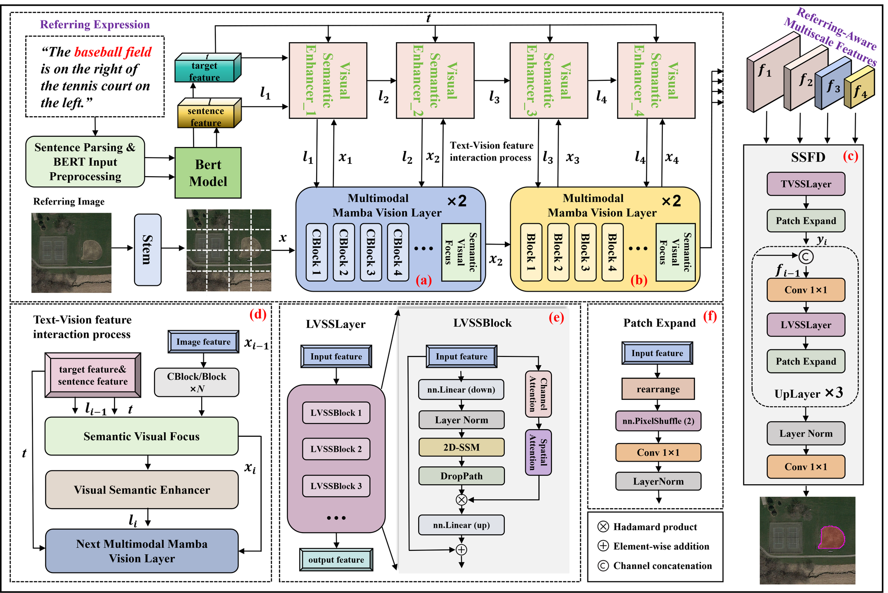

<div align="center">

# PVLMamba

**Target-Anchored Progressive Vision-Language Fusion for Referring Semantic Segmentation in Remote Sensing Images**

[](https://www.python.org/)
[](https://pytorch.org/)
[](#data-preparation)

*Official implementation of the PVLMamba framework.*

</div>

---

## Overview

Referring semantic segmentation in remote sensing images requires jointly interpreting complex overhead
scenes and free-form linguistic instructions, and producing pixel-level masks for the described targets.
PVLMamba (**P**rogressive **V**ision-**L**anguage **Mamba**) is an end-to-end multimodal fusion framework
built around a progressive cross-modal semantic alignment and feature optimization paradigm.

The framework addresses three recurring difficulties in this setting: insufficient optimization of
linguistic features, cross-modal semantic misalignment, and the accumulation of redundant non-target
responses during multimodal integration.

## Architecture

<div align="center">



</div>

*Overall architecture of the proposed PVLMamba. The framework consists of a Multimodal Mamba Vision
Encoder (M2VEncoder) for contextual visual feature extraction, a Visual-Semantic Enhancer (VSE) for
progressive bidirectional cross-modal interaction, and a Selective Scan Fusion Decoder (SSFD) for
reducing redundant non-target responses to support accurate referring remote sensing image semantic
segmentation.*

The VSE operates together with each stage of the M2VEncoder, so the language state is updated and
re-injected progressively rather than fused only at the end of the encoder.

## Installation

```bash
git clone https://github.com/ho077/RS-VLMamba.git
cd RS-VLMamba
pip install -r requirements.txt
```

Requirements:

- Python 3.8+, PyTorch 1.13+ (2.x recommended) with a matching CUDA toolkit;
- [`mamba-ssm`](https://github.com/state-spaces/mamba) and `causal-conv1d`, which must be compiled
  against your local CUDA version — follow the instructions in the official repository if the default
  build does not match your environment;
- `pycocotools` for decoding the COCO RLE annotations shipped with the benchmarks;
- `opencv-python` is recommended for the RefSegRS images, which are stored as PackBits-compressed TIFF;
  install it and pass `--image_backend cv2` if your Pillow build fails on those files.

## Data preparation

The benchmarks are read from a compact JSON-Lines annotation format, one sample per line, together
with the original images. The expected layout is:

```
<DATA_ROOT>/
├── datainfo/
│   ├── refsegrs_train.jsonl
│   ├── refsegrs_val.jsonl
│   ├── refsegrs_test.jsonl
│   ├── rrsisd_train.jsonl
│   ├── rrsisd_val.jsonl
│   └── rrsisd_test.jsonl
│
├── RefSegRS/images/                     # *.tif
└── RRSIS-D/images/rrsisd/JPEGImages/    # *.jpg
```

Annotation fields:

| Dataset | Fields |
| :--- | :--- |
| RefSegRS | `split`, `image_id`, `sent`, `file_name`, `segmentation` |
| RRSIS-D | the above plus `category_id`, `category_name`, `ann_id`, `bbox`, `area` |

Masks are stored as COCO RLE under `segmentation` and are decoded on the fly. `file_name` is resolved
relative to the image root of the corresponding dataset.

Point the code at your own data with environment variables — no path is hard-coded anywhere in the
repository:

```bash
export PVLMAMBA_DATAINFO_ROOT=/path/to/datainfo
export PVLMAMBA_REFSEGRS_IMAGES=/path/to/RefSegRS/images
export PVLMAMBA_RRSISD_IMAGES=/path/to/RRSIS-D/images/rrsisd/JPEGImages
```

## Usage

### Training

```bash
python train.py \
    --dataset rrsisd \
    --img_size 480 \
    --batch-size 4 \
    --epochs 60 \
    --lr 3e-5 \
    --wd 0.01 \
    --seed 3407 \
    --workers 8 \
    --pin_mem \
    --output-dir outputs/checkpoints/rrsisd
```

Checkpoints are written to `--output-dir` as `model_best_<model_id>.pth` and `model_last_<model_id>.pth`,
where the best one is selected on the validation split. The initial model and pre-trained encoders are
fine-tuned jointly; `--bert_trainable_layers <N>` additionally exposes the top `N` text-encoder layers
to the optimizer.

### Evaluation

```bash
python evaluate.py \
    --dataset rrsisd --split test \
    --img_size 480 \
    --resume outputs/checkpoints/rrsisd/model_best_pvlmamba.pth \
    --save_results outputs/rrsisd_test.json
```

This reports cIoU, gIoU, the mean per-image IoU and Pr@X for X ∈ {0.5, …, 0.9}.

### Per-category report

```bash
python tools/each_category.py --dataset rrsisd --split test \
    --resume outputs/checkpoints/rrsisd/model_best_pvlmamba.pth
```

### Visualisation

```bash
python tools/Visual.py --dataset refsegrs --split test \
    --resume outputs/checkpoints/refsegrs/model_best_pvlmamba.pth \
    --visual_dir outputs/visual/refsegrs
```

Predicted masks are rendered together with the input image and the referring expression.
